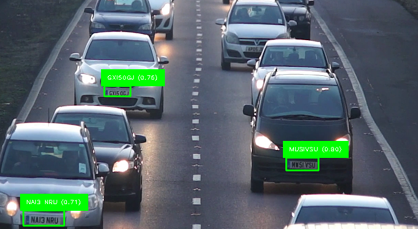

<!-- # Automatic License Plate Recognition (ALPR) — YOLOv8 + PaddleOCR

This project implements an **Automatic License Plate Recognition (ALPR) system** using:
- [YOLOv8](https://github.com/ultralytics/ultralytics) for license plate detection  
- [PaddleOCR](https://github.com/PaddlePaddle/PaddleOCR) for optical character recognition  
- [OpenCV](https://opencv.org/) and [CVZone](https://github.com/cvzone/cvzone) for visualization  

The system detects vehicles and their license plates in **real-time video streams**, draws bounding boxes around the detected plates, and overlays the extracted text directly on the video feed.

---

## 🚀 Features
- **Custom-trained YOLOv8 model** on ~3000 motorway images for robust plate detection  
- **Live video inference** with bounding boxes and text overlays  
- **OCR integration** with PaddleOCR for multilingual text reading  
- **Lightweight pipeline** that runs on video streams frame by frame  
- Fully reproducible with the released weights  

---

## 📸 Dataset & Training
- Annotated **~3000 motorway images** manually in Roboflow (license plates + vehicles).  
- Conducted experiments with **20-epoch training** locally to validate the pipeline.  
- Final **100-epoch training** performed on GPU with the full dataset for higher accuracy.  
- Model saved as: best.pt


The training reference remains in `notebooks/alpr.ipynb` (training cell provided but not run by default).

---

## 📦 Model Weights

The trained weights are available in the **[Releases](../../releases)** section.  

1. Go to the [Releases](../../releases) page of this repository.  
2. Download `best.pt`.  
3. Place the file inside the `weights/` folder:
weights/best.pt


⚠️ **Note on stability**:  
The release was published as a **stable release** . While the model works reliably on many motorway cases, it is still being improved and is not fully production-grade.

---

## 📂 Repository Structure

```
.
├── weights/
│   ├── best.pt        # Downloaded model weights (from Releases)
│   └── .gitkeep       # Keeps folder tracked in Git
├── notebooks/
│   └── alpr.ipynb     # Main notebook (detection + OCR pipeline)
├── requirements.txt
└── README.md
```

---

## ⚙️ Installation

1. Clone this repository:
   ```bash
   git clone <repo-url>
   cd <repo-folder>
   ```

2. Create a virtual environment (recommended):

   - **Linux/Mac:**
     ```bash
     python -m venv venv
     source venv/bin/activate
     ```
   - **Windows:**
     ```bash
     python -m venv venv
     venv\Scripts\activate
     ```

3. Install dependencies:
   ```bash
   pip install -r requirements.txt
   ```

4. Download the model weights from Releases and place in `weights/best.pt` -->

# Automatic License Plate Recognition (ALPR) — YOLOv8 + PaddleOCR

This project implements a **comprehensive Automatic License Plate Recognition (ALPR) system** that combines computer vision and optical character recognition to detect and read license plates from live video streams or recorded footage. Built during my internship at One Network, this system processes traffic control CCTV footage in real-time with high accuracy.

## 🎯 Project Overview

The ALPR system uses a **custom-trained YOLOv8 model** to detect license plates and vehicles, then applies **PaddleOCR** for text extraction. The system provides real-time video processing with live visualization, automatic data logging, and comprehensive detection statistics.

### Core Technologies:
- **[YOLOv8](https://github.com/ultralytics/ultralytics)** - Custom-trained object detection model
- **[PaddleOCR](https://github.com/PaddlePaddle/PaddleOCR)** - Multilingual optical character recognition
- **[OpenCV](https://opencv.org/)** - Computer vision and video processing
- **[CVZone](https://github.com/cvzone/cvzone)** - Enhanced visualization utilities

---

## 📸 Sample Output



The system detects license plates in real-time and overlays the extracted text directly on the video feed. Green bounding boxes indicate detected plates with confidence scores and recognized text displayed above each detection.

---

## 🚀 Key Features

### **Real-Time Detection & Recognition**
- **Live video processing** from CCTV feeds, webcam, or video files
- **Dual object detection**: License plates and vehicles with color-coded bounding boxes
- **Real-time OCR processing** with immediate text overlay on video feed
- **Dynamic confidence scoring** for detection quality assessment

### **Advanced Text Processing**
- **Smart text cleaning** and validation algorithms
- **Multi-format plate support** with configurable validation rules
- **Error handling** for OCR failures and invalid crops
- **Confidence-based filtering** to reduce false positives

### **Comprehensive Data Logging**
- **Real-time CSV export** with immediate data persistence
- **Timestamped detections** with frame-by-frame tracking
- **Bounding box coordinates** for spatial analysis
- **Detection statistics** and frequency analysis
- **Multiple output formats**: Live CSV updates + final summary reports

### **Interactive Controls & Monitoring**
- **Live progress tracking** with frame count and completion percentage
- **Manual save functionality** (press 's' to save current results)
- **Graceful termination** (press 't' to stop processing)
- **Real-time detection counter** displayed on video overlay
- **Error recovery** with fallback options for missing files

### **Flexible Input Sources**
- **Video file processing** (MP4, AVI, etc.)
- **Live webcam feed** support
- **Automatic fallback** to webcam if video file not found
- **Interactive source selection** when files are missing

---

## 📊 Detection Results

### Sample Detection Statistics:
Based on recent test runs, the system achieved:
- **113 total detections** from a single video processing session
- **43 unique license plates** identified
- **Top detected plates**: MMSIVSU (12 times), NAI3 NRU (9 times), MUSIVSU (7 times)
- **Average confidence**: 0.7+ for valid detections

---

## 📦 Model Training & Dataset

### **Dataset Creation**
- **~3000 motorway images** manually annotated using Roboflow
- **Custom labeling** for license plates and vehicles in traffic scenarios
- **High-quality annotations** optimized for motorway/highway environments

### **Training Process**
- **Initial validation**: 20-epoch local training to validate pipeline
- **Production training**: 100-epoch GPU training with full dataset
- **Custom classes**: `['license-plate', 'vehicle']`
- **Model optimization** for real-time inference performance

---

## 📂 Repository Structure

```
license-plate-recognition/
├── weights/
│   ├── best.pt              # Custom-trained YOLOv8 model weights
│   └── .gitkeep             # Keeps folder tracked in Git
├── notebooks/
│   └── alpr.ipynb           # Main Jupyter notebook with full pipeline
├── assets/
│   └── Traffic Control CCTV.mp4  # Sample video file
├── results/                 # Auto-generated detection results
├── sample_output/
│   └── image.png            # Example detection screenshot
├── requirements.txt         # Python dependencies
├── README.md               # Project documentation
└── .gitignore             # Git ignore rules
```

---

## 📦 Model Weights

The trained weights are available in the **[Releases](../../releases)** section.  

1. Go to the [Releases](../../releases) page of this repository.  
2. Download `best.pt`.  
3. Place the file inside the `weights/` folder:
```
weights/best.pt
```

⚠️ **Note on stability**:  
The release was published as a **stable release**. While the model works reliably on many motorway cases, it is still being improved and is not fully production-grade.

---

## ⚙️ Installation & Setup

### **1. Clone Repository**
```bash
git clone https://github.com/your-username/license-plate-recognition.git
cd license-plate-recognition
```

### **2. Create Virtual Environment**
```bash
# Linux/Mac
python -m venv venv
source venv/bin/activate

# Windows
python -m venv venv
venv\Scripts\activate
```

### **3. Install Dependencies**
```bash
pip install -r requirements.txt
```

### **4. Download Model Weights**
1. Go to the **[Releases](../../releases)** section
2. Download `best.pt` 
3. Place in `weights/best.pt`

---

## 🎮 Usage Instructions

### **Running the System**
1. **Open Jupyter Notebook**: Launch `notebooks/alpr.ipynb`
2. **Configure settings** in the first cell:
   ```python
   weights_path = "weights/best.pt"
   video_path = "assets/Traffic Control CCTV.mp4" 
   conf_thresh = 0.5
   ```
3. **Run detection cell** - the system will automatically:
   - Load the YOLO model and initialize OCR
   - Open video source or fallback to webcam
   - Start real-time detection and logging

### **Interactive Controls**
- **Press 't'**: Stop processing and save final results
- **Press 's'**: Manually save current detection summary
- **Keyboard Interrupt (Ctrl+C)**: Emergency stop with data preservation

### **Output Files**
The system generates multiple output files in the `results/` directory


---

## 📈 Detection Output Format

Each detection is logged with comprehensive metadata:

| Field | Description | Example |
|-------|-------------|---------|
| `timestamp` | Detection time | 2025-09-05 23:36:25 |
| `frame_number` | Video frame index | 1 |
| `plate_text` | Extracted text | MOSIVSU |
| `confidence` | Detection confidence | 0.767 |
| `bbox_x1, bbox_y1` | Top-left coordinates | 679, 521 |
| `bbox_x2, bbox_y2` | Bottom-right coordinates | 725, 541 |

---

## 🔧 System Requirements

### **Hardware**
- **CPU**: Multi-core processor (Intel i5+ or AMD equivalent)
- **RAM**: 8GB+ recommended for video processing
- **Storage**: 2GB+ free space for model weights and results
- **GPU**: Optional but recommended for faster inference

### **Software**
- **Python**: 3.8+ (3.10+ recommended)
- **Operating System**: Windows 10+, macOS 10.14+, or Linux
- **Webcam**: Optional for live detection

---

## 🚨 Troubleshooting

### **Common Issues & Solutions**

**Model weights not found:**
- Download `best.pt` from Releases and place in `weights/` folder
- System will offer YOLOv8n fallback for general object detection

**Video file not found:**
- System provides interactive options: webcam, alternative file path, or exit
- Ensure video file is in supported format (MP4, AVI, MOV)


---

## 📄 License

This project is licensed under the **MIT License** - see the [LICENSE](LICENSE) file for details.

---

## 🙏 Acknowledgments

- **One Network** - Internship opportunity and project support
- **Ultralytics** - YOLOv8 object detection framework
- **PaddlePaddle** - PaddleOCR text recognition engine
- **Roboflow** - Dataset annotation and management platform

---


**Note**: This system was developed for educational and research purposes. For production deployment, additional validation and optimization may be required.